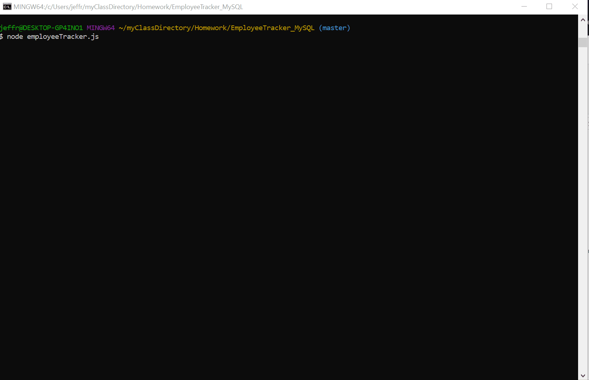

# Employee Tracker (MySQL)

Jeffrey Adamo  
UW Full Stack BootCamp  
[Employee Tracker (MySQL) at GitHub Pages](https://jeffreyadamo.github.io/EmployeeTracker_MySQL/)  
  

***
## Table of Contents

* [Description](#description)

* [Installation](#installation)

* [Usage](#usage)

* [Contributing](#contributing)

* [Tests](#tests)

* [Questions/Contributions](#questions/contributions)

***

## Description

Employee Tracker is a content managament system (CMS) application that uses the command line interface (CLI) to navigate through a MySQL database with employee information. The user has the several CRUD options available through the app (Create, Read, Update, Delete).

  

This application features:
* MySQL database CRUD
* Inquirer npm package CLI
* dot.env password protection configuration
* console.tables for clean viewing

## User Story

```
As a business owner
I want to be able to view and manage the departments, roles, and employees in my company
So that I can organize and plan my business
```


## Installation

Clone the repository using the following command:

```
git clone https://github.com/jeffreyadamo/EmployeeTracker_MySQL.git
```

Please run the following command to install dependencies:

```
npm install
```

Create a new .env file following the .env.sample example and input your personal MySQL password

Use the seed data provided in "EmployeeTrackerSeed.sql" and "employeeTrackerData.sql" to create and populate the "employeeTracker_db" database in MySQL Workbench 8.0

You are ready to run the application in the command prompt!

## Usage

### [For installation and usage information please visit the tutorial video here](https://youtu.be/JPuOT209Sgs)

Start the application by running the following command:
```
node employeetracker.js
```

Follow the prompts provided in the command line interface:
* View All Employees
* View All Roles
* View All Departments
* Add Employee
* Add Department
* Add Role
* Update Employee Role
* Quit

  

## Issues

Future developments to include the following bonus features:
  * Update employee managers
  * View employees by manager
  * Delete departments, roles, and employees
  * View the total utilized budget of a department -- ie the combined salaries of all employees in that department


## Tests
```
none
```

## Questions/Contributions

For questions or comments about this app, open an issue or contact my GitHub  


    

@ [jeffreyadamo](http://www.github.com/jeffreyadamo)  

Cheers!


 